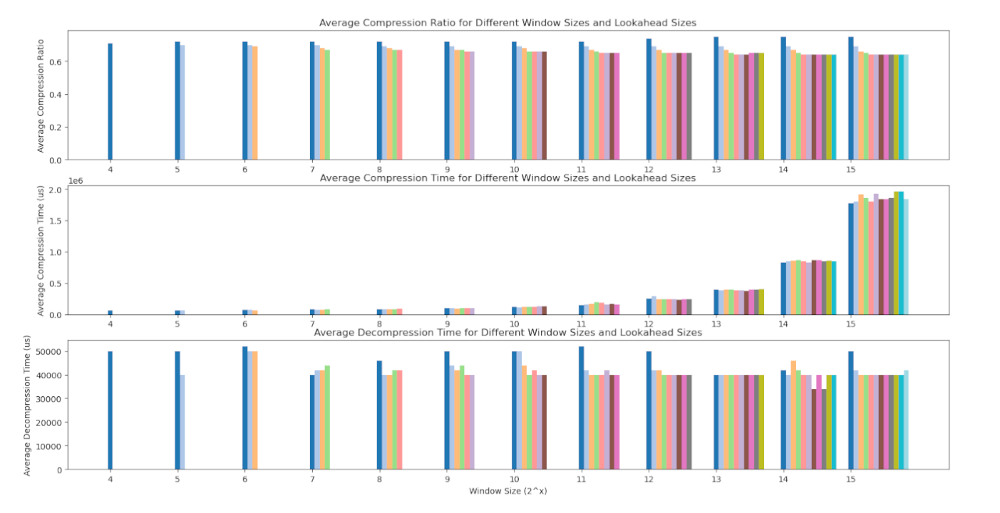

# heatshrink-rs

A `no_std` Rust implementation of [Heatshrink] compression and decompression
for embedded systems.

Heatshrink is an [LZSS]-based algorithm designed for low-memory environments.
It operates with bounded, incremental CPU use, making it suitable for hard
real-time systems.

[Heatshrink]: https://github.com/atomicobject/heatshrink
[LZSS]: https://en.wikipedia.org/wiki/Lempel-Ziv-Storer-Szymanski

## Features

- **`no_std`, no allocator required** — runs on bare-metal targets.
- **Configurable parameters** — window size `W` and lookahead `L` are const
  generics; any valid `(W, L)` combination can be used at zero runtime cost.
- **Idiomatic Rust API** — `sink`, `poll`, and `finish` return `Result` types;
  no C-style return codes.
- **Optional search index** — enable the `heatshrink-use-index` feature to
  significantly speed up compression at the cost of extra memory.
- **`embedded-io` adapters** — enable the `embedded-io` feature to use the
  encoder and decoder as `Read`/`Write` streams in `embedded-io` pipelines.
- **ISC licence** — free to use, including for commercial purposes.

## Parameters

Both the encoder and decoder are parameterised by const generics:

| Parameter | Description | Constraints |
|-----------|-------------|-------------|
| `W` | Base-2 log of the LZSS sliding window size | 4 ≤ W ≤ 15 |
| `L` | Number of bits for back-reference lengths | 3 ≤ L < W |
| `BUF` | Encoder input buffer size (= `2 << W`) | Must equal `2 << W` |
| `I` | Decoder streaming input buffer size | ≥ 1 |
| `WIN` | Decoder window buffer size (= `1 << W`) | Must equal `1 << W` |

`BUF` and `WIN` are redundant parameters required by a current Rust stable
limitation: arithmetic expressions are not yet allowed in const-generic array
sizes. Always set `BUF = 2 << W` and `WIN = 1 << W`.

The convenience type aliases [`DefaultEncoder`] and [`DefaultDecoder`] use
`W=8, L=4` to match the original C library defaults.

## Quick Start

### Convenience functions (single-call, buffer-to-buffer)

```rust
use heatshrink::{encoder, decoder};

let input = b"hello heatshrink";
let mut compressed   = [0u8; 64];
let mut decompressed = [0u8; 64];

let encoded = encoder::encode(input, &mut compressed).unwrap();
let decoded = decoder::decode(encoded, &mut decompressed).unwrap();

assert_eq!(input, decoded);
```

### Streaming API

Use the streaming API when processing data in chunks or when working under
tight memory constraints.

```rust
use heatshrink::{DefaultEncoder, DefaultDecoder, Poll, SinkError, Finish};

// ── Encoding ──────────────────────────────────────────────────────────────────
let input = b"hello heatshrink - streaming example";
let mut compressed = [0u8; 128];
let mut enc = DefaultEncoder::new();
let mut total_in  = 0;
let mut total_out = 0;

loop {
    if total_in < input.len() {
        match enc.sink(&input[total_in..]) {
            Ok(n)                  => total_in += n,
            Err(SinkError::Full)   => {}   // drain with poll() first
            Err(SinkError::Misuse) => panic!("sink after finish"),
        }
    }
    if total_in == input.len() {
        enc.finish();
    }
    match enc.poll(&mut compressed[total_out..]) {
        Ok(Poll::More(n))  => total_out += n,
        Ok(Poll::Empty(n)) => {
            total_out += n;
            if total_in == input.len() { break; }
        }
        Err(_) => panic!("empty output buffer"),
    }
}

// ── Decoding ──────────────────────────────────────────────────────────────────
let mut decompressed = [0u8; 128];
let mut dec = DefaultDecoder::new();
let mut dec_in  = 0;
let mut dec_out = 0;

loop {
    if dec_in < total_out {
        match dec.sink(&compressed[dec_in..total_out]) {
            Ok(n)                  => dec_in += n,
            Err(SinkError::Full)   => {}
            Err(SinkError::Misuse) => panic!(),
        }
    }
    match dec.poll(&mut decompressed[dec_out..]) {
        Ok(Poll::More(n))  => dec_out += n,
        Ok(Poll::Empty(n)) => {
            dec_out += n;
            if dec_in == total_out { break; }
        }
        Err(_) => panic!("empty output buffer"),
    }
}

assert_eq!(&input[..], &decompressed[..dec_out]);
```

### Custom parameters

```rust
use heatshrink::{encoder::HeatshrinkEncoder, decoder::HeatshrinkDecoder};

// W=11, L=6 — BUF = 2<<11 = 4096, WIN = 1<<11 = 2048
type MyEncoder = HeatshrinkEncoder<11, 6, 4096>;
type MyDecoder = HeatshrinkDecoder<11, 6, 32, 2048>;
```

## `embedded-io` adapters

Enable the `embedded-io` feature to use the encoder and decoder as
`embedded_io::Read` and `embedded_io::Write` streams:

```toml
[dependencies]
heatshrink-lib = { version = "...", features = ["embedded-io"] }
```

Four adapters are available in the `heatshrink::io` module:

| Adapter | Trait | Direction |
|---------|-------|-----------|
| `EncoderWriter<W, ENC>` | `Write` | Compress bytes written in → forward to inner `Write` |
| `DecoderWriter<W, DEC>` | `Write` | Decompress bytes written in → forward to inner `Write` |
| `EncoderReader<R, ENC>` | `Read`  | Read compressed bytes ← pull raw bytes from inner `Read` |
| `DecoderReader<R, DEC>` | `Read`  | Read decompressed bytes ← pull compressed bytes from inner `Read` |

Call `finish()` on the `Write` adapters when all data has been written.

```rust
# #[cfg(feature = "embedded-io")] {
use heatshrink::io::{EncoderWriter, DecoderWriter, SliceSink};
use heatshrink::{DefaultEncoder, DefaultDecoder};
use embedded_io::Write as _;

let input = b"hello heatshrink embedded-io";
let mut compressed   = [0u8; 64];
let mut decompressed = [0u8; 64];

// Compress
let mut sink = SliceSink::new(&mut compressed);
let mut enc: EncoderWriter<_, DefaultEncoder> = EncoderWriter::new(&mut sink);
enc.write_all(input).unwrap();
enc.finish().unwrap();
let n_enc = sink.len();

// Decompress
let mut sink2 = SliceSink::new(&mut decompressed);
let mut dec: DecoderWriter<_, DefaultDecoder> = DecoderWriter::new(&mut sink2);
dec.write_all(&compressed[..n_enc]).unwrap();
dec.finish().unwrap();

assert_eq!(input, sink2.written());
# }
```

## Cargo features

| Feature | Default | Description |
|---------|---------|-------------|
| `heatshrink-use-index` | ✓ | Enable the search index for faster compression |
| `embedded-io` | ✗ | Enable `embedded_io::Read`/`Write` adapters |

## Memory usage

With the default parameters `W=8, L=4` (measured with `core::mem::size_of`):

| Configuration | `DefaultEncoder` | `DefaultDecoder` |
|---------------|-----------------|-----------------|
| Without `heatshrink-use-index` | 552 bytes | 328 bytes |
| With `heatshrink-use-index` | 1576 bytes | 328 bytes |

The search index adds `2 << W` × 2 bytes to the encoder: for W=8 that is
512 × 2 = 1024 bytes. Larger window sizes grow the index proportionally —
at W=14 the index alone occupies 32 KB.

## Performance

The choice of `W` and `L` parameters affects compression ratio, compression
speed, and decompression speed. The graphs below illustrate these trade-offs
for a representative dataset.

Benchmarks were run on a Core i5-8350U @ 1.7 GHz using accelerometer compressed
data.



## Migrating from 0.4.x

Version 0.4.x had hardcoded parameters (`W=8, L=4`) and C-style return codes.
The current API differs in the following ways:

- **Parameters are now const generics.** Use `DefaultEncoder` / `DefaultDecoder`
  to keep the previous behaviour, or choose any `(W, L)` pair.
- **`sink()` returns `Result<usize, SinkError>`** instead of `HSsinkRes`.
- **`poll()` returns `Result<Poll, PollError>`** instead of `HSpollRes`.
- **`finish()` returns `Finish`** instead of `HSfinishRes`.
- **`encode()` / `decode()` return `Result<&[u8], CodecError>`** instead of
  `Result<&[u8], HSError>`.

## More information

- [Blog post: Heatshrink overview](http://spin.atomicobject.com/2013/03/14/heatshrink-embedded-data-compression/)
- [Blog post: Lightweight indexing](http://spin.atomicobject.com/2014/01/13/lightweight-indexing-for-embedded-systems/)
- [Original C library](https://github.com/atomicobject/heatshrink)
